<p align="center">
  
</p>

<p align="center">
  Path of Exile's itemization and damage pipeline, Last Epoch's build crafting, roguelite map preparation, and infinite progression. In Hytale.
</p>

<p align="center">
  <b>Release 1.0.0 - ModJam</b>
</p>

---

AI has been and is my main and sole tool for creating this project. If you're not fine with it, I apologise.

## Recommended Mods

Trail of Orbis works standalone, but these mods are fully compatible and tested :

| Mod | What it does | Notes |
|:----|:-------------|:------|
| **[Hexcode](https://www.curseforge.com/hytale/mods/hexcode)** | Replaces base Hytale magic with a full spell-crafting system. Fully integrated with the RPG damage pipeline, tooltips, and magic nodes in the Skill Tree all adapt automatically. | Highly recommended. Incompatible with PartyPro (HUD conflict). |
| **[The Armory](https://www.curseforge.com/hytale/mods/the-armory)** | Over 1000 new cosmetic weapons and armors. Trail of Orbis includes built-in transmogrification at the Builder's Workbench - change the look of your RPG gear to any skin while keeping all stats. | Recommended. |
| **[Loot4Everyone](https://www.curseforge.com/hytale/mods/loot4everyone)** | Better shared container loot for multiplayer. Trail of Orbis already includes distance-based shared loot for containers, but Loot4Everyone is a better implementation. | Optional. |
| **[PartyPro](https://www.curseforge.com/hytale/mods/partypro)** | Better group system. Trail of Orbis includes distance-based shared XP, but PartyPro adds proper party features. | Optional. Incompatible with Hexcode (HUD conflict). |

## What It Does

There are no classes. Your build is the sum of everything : the Gear Modifiers you roll and craft, the Skill Tree nodes you allocate across 485 options, the weapon type you wield, the Stones you invest into your equipment, and the Attribute points you spread across 6 Elements. Every system feeds every other.

**Realms** are the core loop. Consumable maps open portals to procedural instanced dungeons. Maps drop at 12% per kill from level 1, not a late unlock. Every Portal Device is an Ancient Gateway with a tier that limits which map levels it can channel. Mine overworld ores to upgrade your gateways, and push deeper.

> **Craft Gear → Kill Mobs → Get Loot, Stones & Maps → Upgrade Gateways → Enter Realms → Get Better Loot → Push Deeper → Repeat**

<p align="center">
  
  <br><i>485-node Skill Tree - explore and allocate in a 3D instance</i>
</p>

## By the Numbers

| System | Count |
|:-------|------:|
| Elemental Attributes | 6 |
| Attribute-derived stats | 30 (5 per element, zero overlap) |
| Computed stat fields | 246 |
| Skill Tree nodes | 485 |
| Gear Modifier definitions | 101 |
| Equipment types | 42 |
| Stone types | 25 |
| Realm biomes | 14 |
| Realm Modifiers | 13 (7 difficulty + 6 reward) |
| Gateway tiers | 7 (Copper → Adamantite) |
| Max level | 1,000,000 |

## Systems

**Progression** - 6 Elements (Fire, Water, Lightning, Earth, Wind, Void), each with 5 unique stats. 485-node Skill Tree you explore physically in a 3D instance, walk up to orbs, press F. Free respec. Level cap of 1,000,000 with effort-based scaling.

**Combat** - 11-stage damage pipeline (Base → Flat → Elemental → Conversion → % Physical → % Elemental → % More → Conditionals → Crit → Defenses → True Damage). 4 Ailments. Evasion vs Accuracy formula. Active blocking. Death Recap on every death.

**Equipment** - 7 rarities, 101 Modifier definitions, Quality 1-101. 25 Stones across 7 categories for rerolling, enhancing, locking, and corrupting gear. Loot Filter for configurable item filtering.

**Realms** - 14 biome types, 4 sizes (15-70 mobs), 13 Map Modifiers. 7 difficulty prefixes make Realms harder, 6 reward suffixes make the loot better. Harder maps = better drops. Always.

**Mob Scaling** - 5 mob classes with 52 stat types generated via Dirichlet distribution. Dynamic Elite spawns. Each mob has a unique stat profile.

<p align="center">
  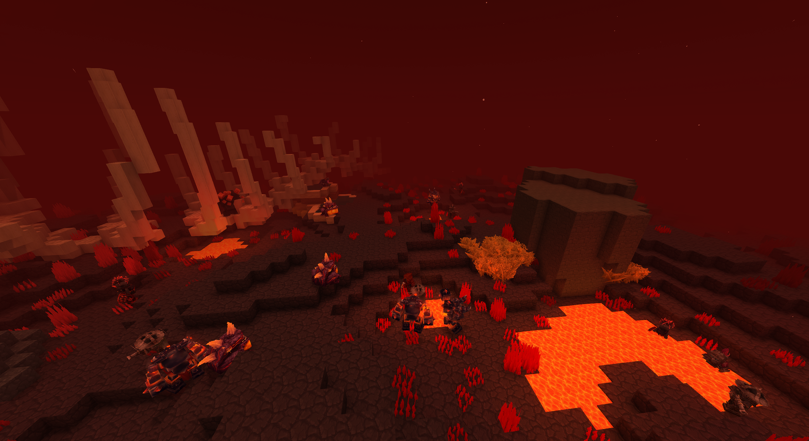
  <br><i>Volcano Realm - one of 14 procedural biomes</i>
</p>

<p align="center">
  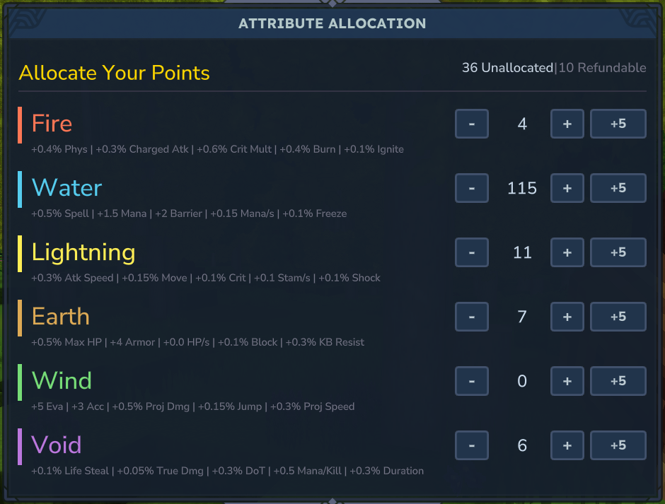
  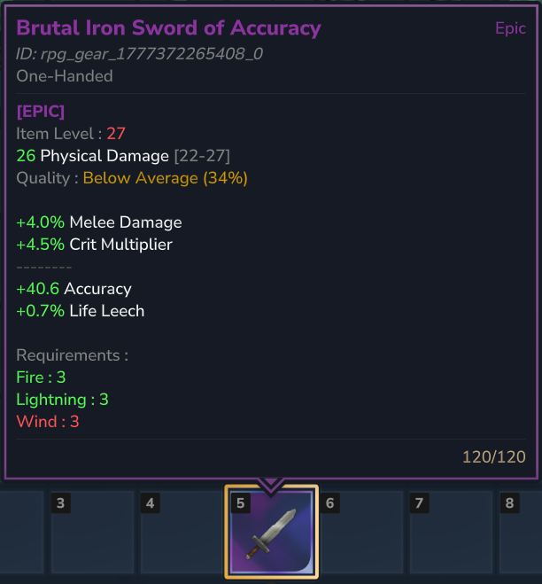
  <br><i>Attribute allocation across 6 Elements + Epic gear with rolled Modifiers</i>
</p>

## Screenshots

<details>
<summary>More screenshots</summary>

| | |
|:---:|:---:|
|  | 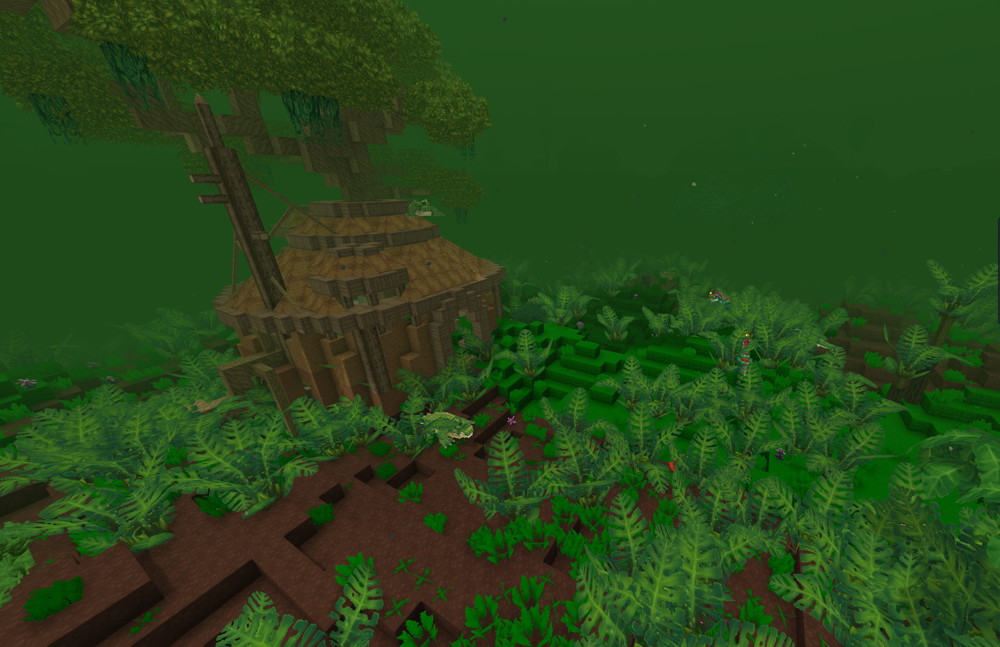 |
| *Beach Realm* | *Jungle Realm* |
| 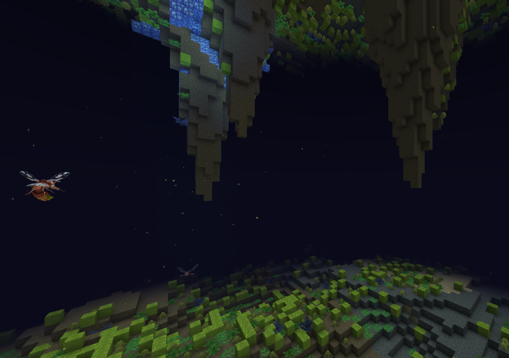 | 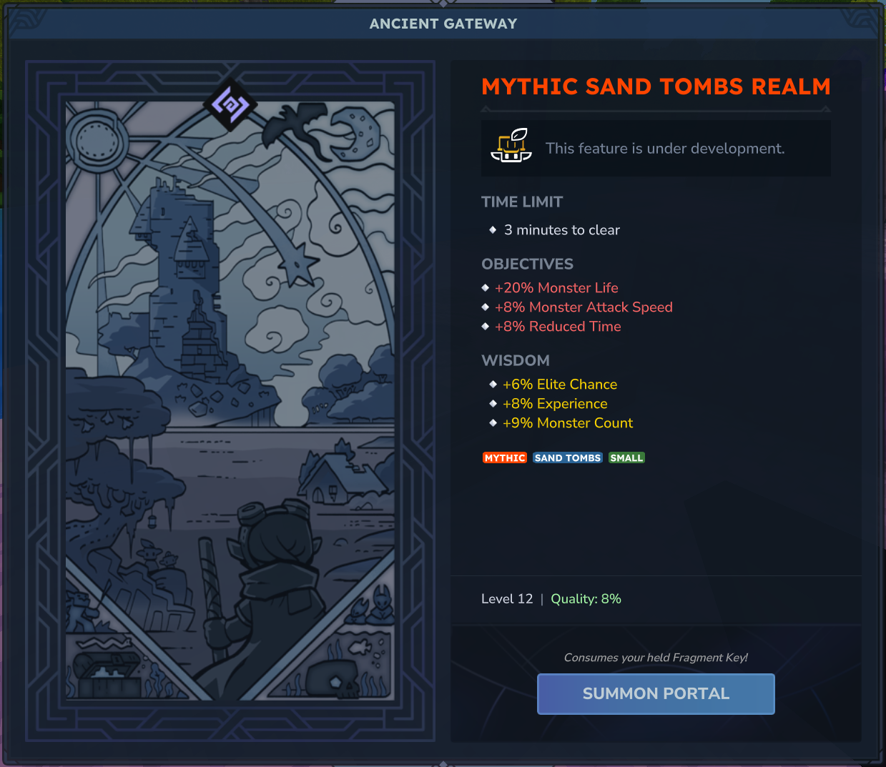 |
| *Caverns Realm* | *Realm Entrance UI* |
| 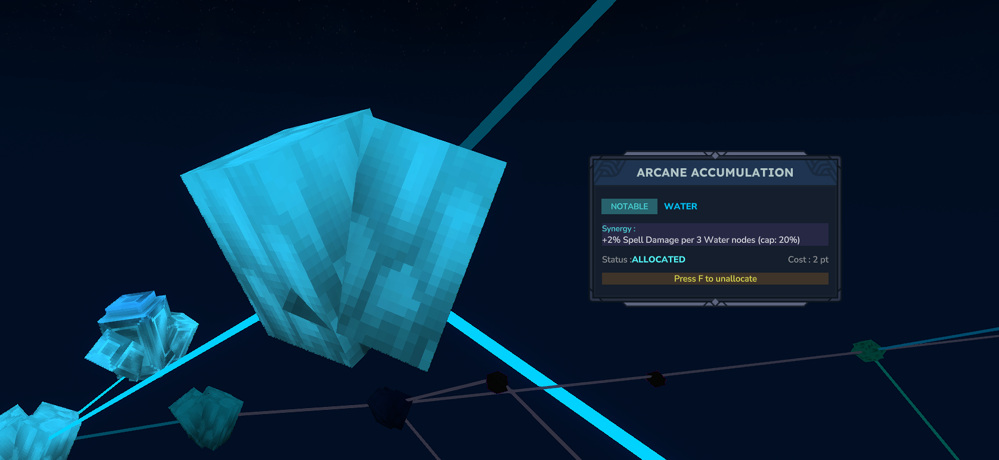 | 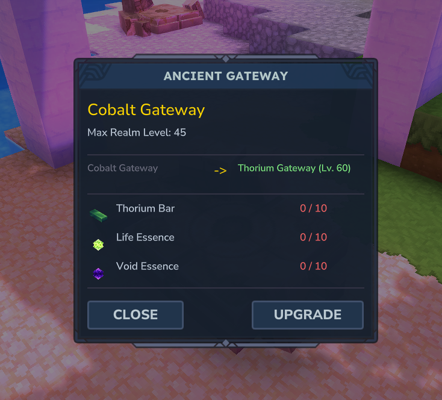 |
| *Skill Tree Node HUD* | *Ancient Gateway Upgrade UI* |
| 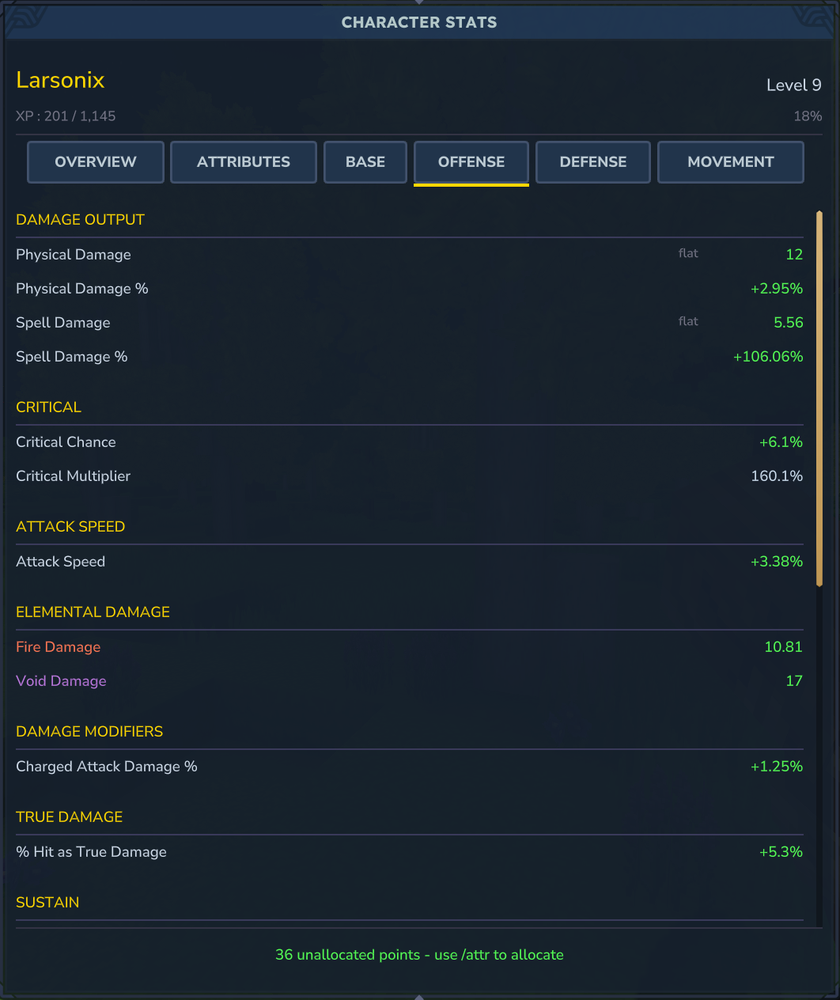 | 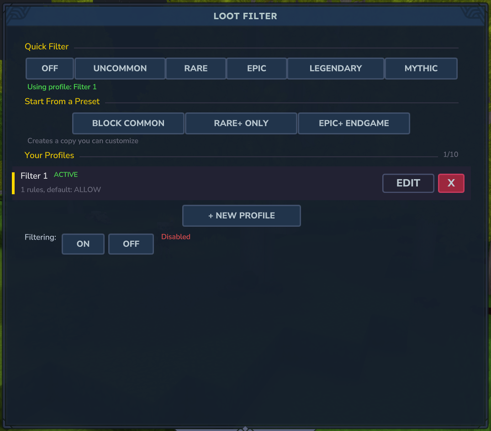 |
| *Offensive Stats UI* | *Loot Filter UI* |
| 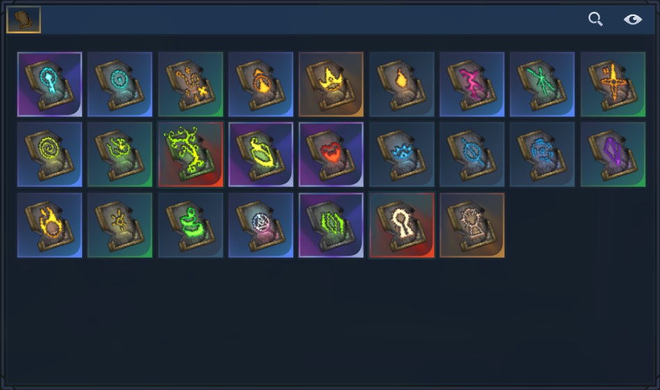 | 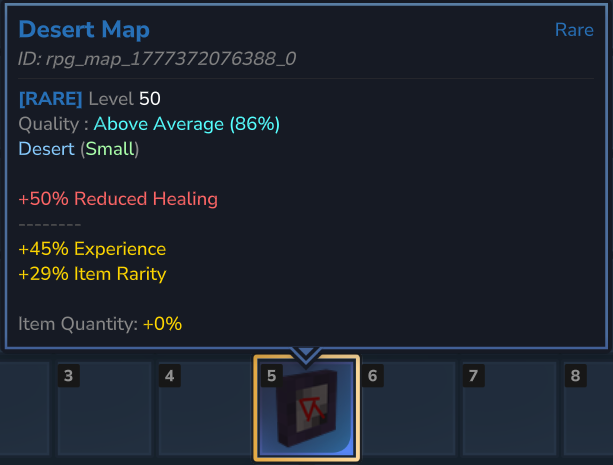 |
| *25 Consumable Stones* | *Rare Realm Map Tooltip* |
| 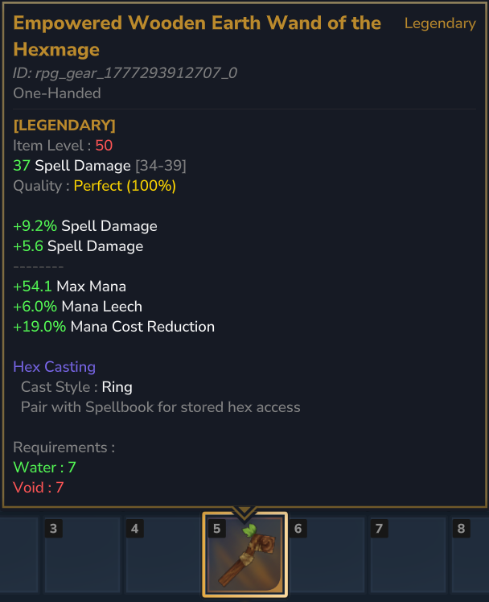 | 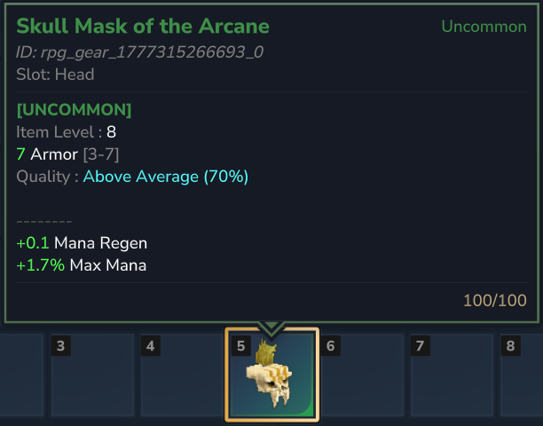 |
| *Hexcode Legendary Staff (with RPG integration)* | *Uncommon Helmet Tooltip* |

</details>

## Installation

**Players** - Just join the server. Hytale mods are server-side, no client setup needed.

**Server operators** - Place the JAR in your server's `mods/` directory. The asset pack is bundled. See the [Getting Started](https://wiki.hytalemodding.dev/en/docs/Larsonix_TrailOfOrbis/getting-started) guide.

## Building from Source

Requires an active internet connection for the first build (resolves Hytale Server API from [Maven](https://maven.hytale.com/release)).

```bash
./gradlew clean build        # Build + run all tests
./gradlew shadowJar          # Fat JAR only (no tests)
```

Java 25 is auto-provisioned by the Gradle toolchain. Gradle 8.14 is included via wrapper.

### Deploy

```bash
export HYTALE_SERVER_DIR="/path/to/your/HytaleServer"
./scripts/deploy.sh
```

Deploys three things :
1. **Plugin JAR** - The compiled mod
2. **Asset Pack** (`TrailOfOrbis_Realms/`) - Items show "Invalid Item" without this
3. **Config files** - YAML synced to the server

## Project Structure

```
src/main/java/io/github/larsonix/trailoforbis/
  ailments/       Burn, Freeze, Shock, Poison
  attributes/     6 Elements, computed stats, calculators
  combat/         11-stage damage pipeline, avoidance, blocking
  gear/           Equipment generation, modifiers, tooltips, quality
  gems/           Active and Support Gems (WIP)
  leveling/       XP/level system, effort-based formula
  loot/           Drop tables, loot generation
  lootfilter/     Player-configurable loot filtering
  maps/           Realm instances, portals, spawning, rewards, gateways
  mobs/           Mob scaling, classification, Dirichlet distribution
  sanctum/        3D Skill Tree world, node spawning, beam rendering
  skilltree/      485 nodes, allocation, synergies, conditionals
  stones/         25 consumable crafting currencies
  ui/             Stats, Attributes, Skill Tree, XP bar, inventory
```

## Dependencies

| Dependency | Purpose | Bundled? |
|:-----------|:--------|:--------:|
| [Hytale Server API](https://maven.hytale.com) | Core game API | No (compile-only) |
| [HyUI](https://www.curseforge.com/hytale/mods/hyui) | UI builder library | Yes |
| [H2 Database](https://h2database.com) | Embedded player data | Yes |
| [HikariCP](https://github.com/brettwooldridge/HikariCP) | Connection pooling | Yes |
| [SnakeYAML](https://github.com/snakeyaml/snakeyaml) | YAML config parsing | Yes |

Optional (not bundled) : MySQL, PostgreSQL drivers for external database support.

## Credits

- **LadyPaladra** - All visual assets : textures, models. Also creator of [The Armory](https://www.curseforge.com/hytale/mods/the-armory)
- **tiptox** - Logo

## License

- **Code** - [LGPL-3.0](LICENSE)
- **Assets** - [CC-BY-NC-SA-4.0](LICENSE-ASSETS)

## Links

- [Wiki](https://wiki.hytalemodding.dev/en/docs/Larsonix_TrailOfOrbis) (also accessible in-game via Voile)
- [Contributing](CONTRIBUTING.md)
- [Hytale Modding Discord](https://discord.com/channels/1440173445039132724/1464056907005169756)
